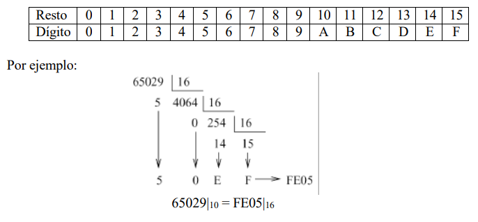

# UnaMasPorfavor

## Ejercicio 1: Dado el siguiente fragmento de código C:

```java 

static final double N = 2;
static final double PREC = 1e-6;
static double f (double x)
{
return x*x-N;
}
static double bisect (double min, double max)
{
double med = (min+max)/2;
if (max-min<PREC) {
return med;
} else if (f(min)*f(med)<0) {
return bisect (min,med);
} else {
return bisect (med,max);
}
}
```

1. ¿Qué calcula la llamada a la función recursiva bisect(0,N)? Si cambiamos el
   valor de N, ¿qué estaríamos calculando? ¿Y si cambiásemos la función f(x)?

- La llamada a la funcion recursiva calcula la raiz de la funcion f(x) en el intervalo [0,N] con una precision de 1e-6. Si cambiamos el valor de N, estariamos calculando la raiz de la funcion f(x) en el intervalo [0,N] con una precision de 1e-6. Si cambiamos la funcion f(x) por f(x) = x^3 - N, estariamos calculando la raiz de la funcion f(x) en el intervalo [0,N] con una precision de 1e-6.
- Si cambiamos el valor de N, la funcion f(x) cambia tambien, aunque se calcularia la raiz de la misma manera.
- Si cambiamos la funcion f(x) se calcula la raiz de la funcion f(x) en el intervalo [0,N] con una precision de 1e-6, aunque puede surguir un error si cambiamos f(x) a una funcion donde no tenga raiz.


2. Implemente un algoritmo iterativo equivalente.


## Ejercicio 2: Dado el siguiente algoritmo recursivo:

```java

void f(int num, int div){
    if (num>1) {
        if ((num%div) == 0) {
            System.out.println(div);
            f(num/div,div);
        } else {
            f(num,div+1);
        }
    }
}
```
1. Dado un número cualquiera x, ¿qué nos muestra por pantalla la llamada a la función
   recursiva f(x,2)? ¿Cuál sería un nombre más adecuado para la función f?

2. Implemente un algoritmo iterativo y uno implementado mediante expresiones lambda
   equivalentes.

## Ejercicio 3: Construya una función que convierta un número decimal en una cadena que represente el valor del número en hexadecimal (base 16). 
A continuación, generalice la función para convertir un número decimal en un número en base B (con B<10). Resuélvalo mediante expresiones lambda.

Recordatorio: El cambio de base se realiza mediante divisiones sucesivas por 16
en las cuales los restos determinan los dígitos hexadecimales del número según
la siguiente correspondencia:



## Ejercicio 4: 
Implemente, tanto de forma recursiva como de forma iterativa, una función que nos diga
si una cadena de caracteres es simétrica (un palíndromo). Por ejemplo, “DABALEARROZALAZORRAELABAD” es un palíndromo.

## Ejercicio 5:

Implemente, tanto de forma recursiva como de forma iterativa y con expresiones lambda,
una función que nos devuelva el máximo común divisor de dos números enteros
utilizando el algoritmo de Euclides.

ALGORITMO DE EUCLIDES
Dados dos números enteros positivos m y n, tal que m > n,
para encontrar su máximo común divisor
(es decir, el mayor entero positivo que divide a ambos):
- Dividir m por n para obtener el resto r (0 ≤ r < n)
- Si r = 0, el MCD es n.
- Si no, el máximo común divisor es MCD(n,r).
